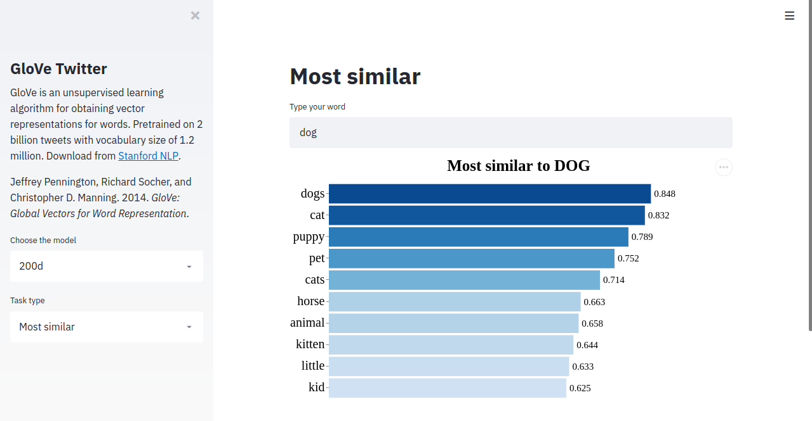

Simple GloVe embeddings explorer (powered by [Streamlit](https://github.com/streamlit/streamlit))
===
Streamlit demonstration project. You can run it on cloud (tested on Google Cloud CE) or locally.




# Own environment 
1. Install dependencies
    ```
    pip install -r requirements.txt
    ```
2. Download word embeddings
    ```
    chmod +x download_glove.sh
    ./download_glove.sh
    ```
3. Run the app
    ```
    streamlit run run_app.py
    ```

# Docker
1. Download word embeddings locally
    ```
    chmod +x download_glove.sh
    ./download_glove.sh
    ```
2. Build image
    ```
    docker build -t glove_streamlit .
    ```
3. Run docker container
    ```
    docker run -p 8501:8501 -v ${PWD}:/opt/app glove_streamlit
    ```